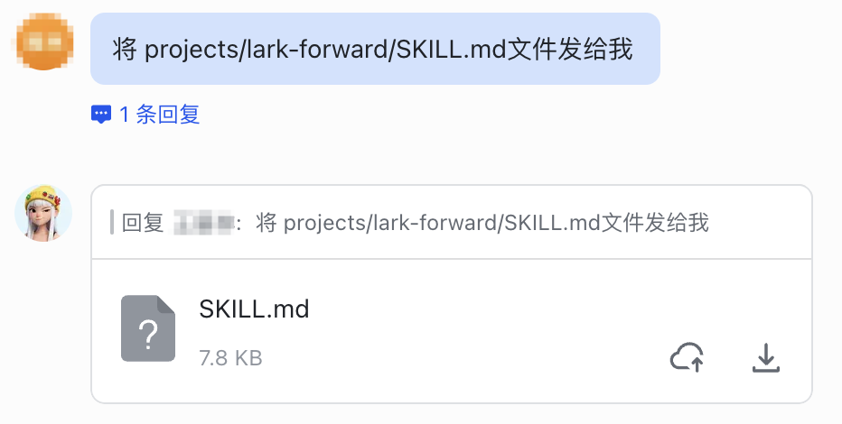
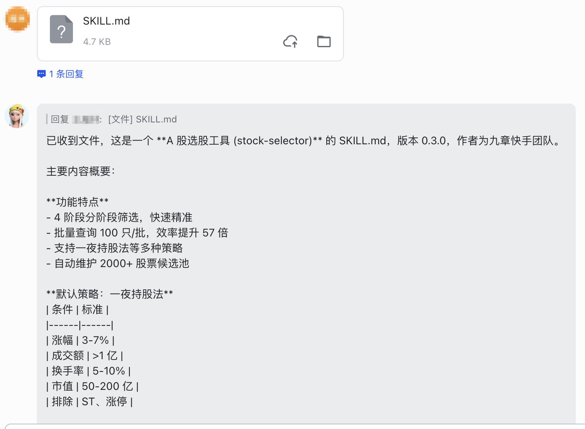
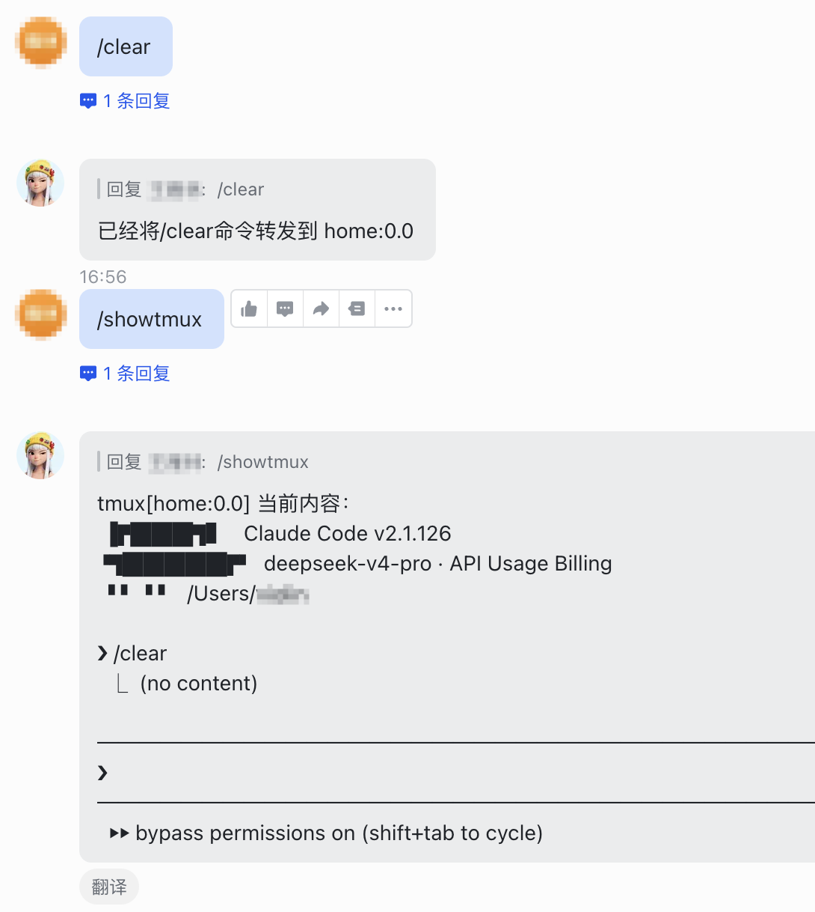
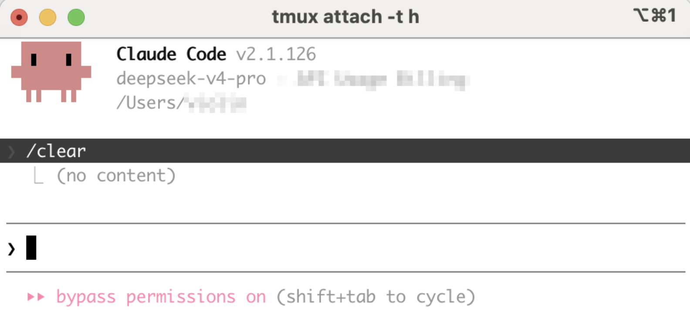

# lark-forward
`lark-forward` 是一个飞书消息转发Skill，实现用飞书对话形式与任意命令行Agent/CodingAgent进行交互，例如claude code、codex等。

[English](./README.en.md)

# 功能
## 消息转发（CodingAgent能收发消息）
| 消息转发 | 发文件 | 获取文件 |
|--------|------------|------------|
|  |  |  |


## 斜杠命令透传（/showtmux为此skill自带命令，不透传，用于直接显示tmux窗口标准输出）
| 飞书侧 | tmux窗口侧 |
|--------|------------|
|  |  |

# 快速开始
将下面的提示词发送给你的 CodingAgent（如 Claude Code、Codex 等），它会按照 [INSTALL.md](https://github.com/violin0847/lark-forward/raw/refs/heads/master/INSTALL.md) 完成安装与初始化：

```
请按照本仓库根目录下的 [INSTALL.md](./INSTALL.md) 中的步骤，为我安装并初始化 lark-forward。
```

# 手动安装
## 1. 安装依赖
### 1.1 安装 `lark-cli` 并创建飞书机器人（如果环境中已有则跳过）
- 安装 `lark-cli`
```bash
npx @larksuite/cli@latest install
```

- 创建一个新机器人
```bash
lark-cli config init --new
```

- 授权推荐的权限
```bash
lark-cli auth login --recommend
```

更多详见 [飞书 CLI 能力介绍与最佳实践](https://bytedance.larkoffice.com/docx/WnHkdJQM6oGpQFxm9i7ckVdenSh)。

### 1.2 安装 `tmux`
- 安装命令（以 Ubuntu/Debian 为例，macOS 可使用 `brew install tmux`）：
```bash
sudo apt install tmux
```

- 建议打开鼠标支持（可以点击切换 pane，滚动翻页）：
```bash
echo "set -g mouse on" >> ~/.tmux.conf
tmux source ~/.tmux.conf
```

- 常用 `tmux` 命令：
```bash
# 开 session
tmux
tmux new -s <自定义session名>

# attach 到已存在的 session
tmux attach -t <session名前缀>

# 列举 session
tmux ls
```

退出 session 但保持该窗口持续运行的快捷键：先按 `Ctrl+B`，再按字母 `D`。
kill 某个小窗口(pane) 快捷键：切到对应 pane 后按 `Ctrl+D`。

## 2. 安装 `lark-forward`
1. 打包`SKILL.md`和`scripts/lark_forward.sh`文件
```bash
make
```
将 make 的产物 `dist/lark-forward.zip` 作为 Skill 安装到对应的 coding agent 中。

## 3. 使用方式
安装完成后，打开 `tmux`，启动任意 CodingAgent，并向它输入：
```
将飞书消息接收转发到这里。
```

接着即可通过飞书机器人代替终端交互向该 CodingAgent 发送消息。

### 飞书侧支持的命令

| 命令 | 说明 |
|------|------|
| `/<任意命令>` | 斜杠开头的消息会作为命令直接透传到当前转发的 tmux pane，不会触发 CodingAgent 回复流程。例如 Claude Code 的 `/clear`、`/compact`，Codex 的 `/model` 等都可以直接通过飞书消息发送。 |
| `/showtmux` | 内置命令。请求 `lark-forward` 守护进程截取当前转发目标 tmux pane 的内容，并以飞书消息形式回复给发送者，便于在飞书中直接查看 CodingAgent 的当前终端状态。 |

> Tip：`/showtmux` 由 `lark-forward` 守护进程直接处理，不会把命令本身发送给 CodingAgent；其他斜杠命令则会原样透传到 tmux pane 中。
